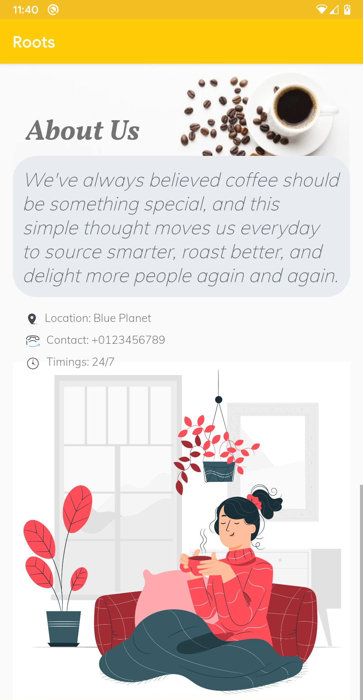
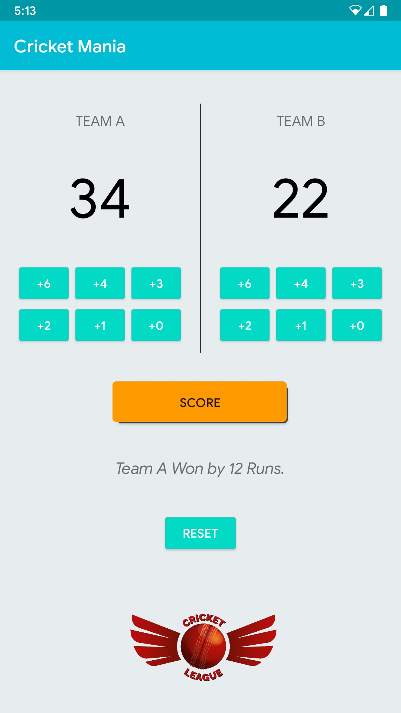

# Android-Basics-Nanodegree
> Projects made during the Android Basics Nanodegree offered by Udacity, sponsored by Google (Google India Scholarship Program)

## [Project 1: Single Screen Application](https://github.com/DivineRoot/Android-Basics-Nanodegree/tree/master/RootsCafe)

## [Project 2: Score Tracker Application](https://github.com/DivineRoot/Android-Basics-Nanodegree/tree/master/ScoreKeeper)

## [Project 3: Quiz Application](https://github.com/DivineRoot/Android-Basics-Nanodegree/tree/master/QuizApp)

---

## License

Licensed under [MIT License](LICENSE).
